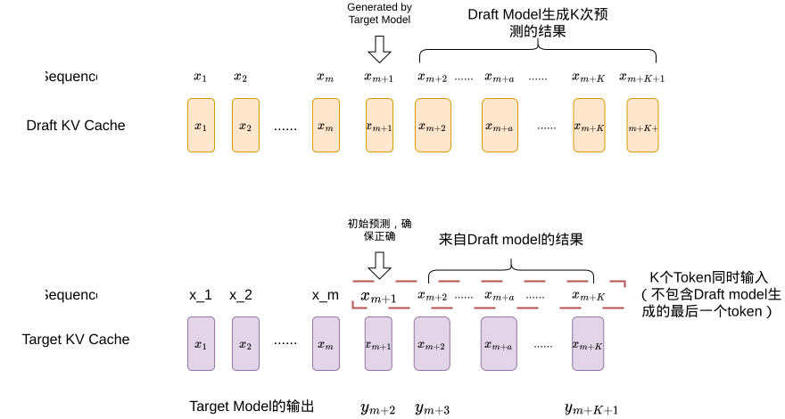
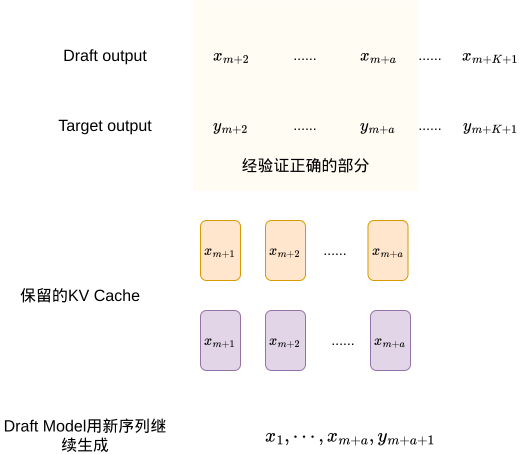

# A Simple LLM Inference Engine based on Speculative Decoding

基于投机采样实现的一个单用户请求大模型推理引擎。

## 主要功能

- K步前瞻的投机采样（采用贪婪采样）
- Target Model和Draft Model均采用KV Cache加速推理
- 发生错误时支持KV Cache回滚
- 根据历史接受率自动调整 draft model 的预测长度


##  KV Cache回滚逻辑示意图

1. 让draft model连续预测K的token，并将前K-1个token与初始输入送进target model进行验证



2. 将target model的输出结果与draft model的猜测结果比对，仅保留正确部分的KV cache




## 自适应调整投机步数

采用了一个简单的滑动窗机制来调整使用 draft model 预测的token 数量：
- 维护一个接受率的滑动窗口，记录最近10次生成中被接受的draft token数量与总draft token数量的比值
- 每次生成后计算平均接受率，如果接受率过低（如<0.5）则减少K的值，如果接受率过高（如>0.8）则增加K的值，以此来动态调整投机步数，平衡生成速度和生成质量


## 效果对比

实验设置：
- 模型：Qwen 7B (Target Model), Qwen 1.5B (Draft Model)
- 设备：RTX 4090
- Batch Size: 1
- Baseline: 直接使用target model生成
- 最大生成长度：512 tokens


1. prompt: Repeat "abc123\" for 50 times.

| 方案 | 生成速度 (Token/s) | 加速比 | 平均接收率 |
| :---: | :---: | :---: | :---: |
| baseline |  56.05   |   1    |   -   |
| SD （K=4）| 72.52 |  1.29 | 0.97 |
| SD （K=8）| 85.87 | 1.53 | 0.93 |
| SD （K=16）|  90.86  | 1.62 |  0.88  |
| SD （Adaptive）|  94.87  | 1.69 |  0.91  |

2. prompt: Write a Python function to compute Fibonacci numbers.

| 方案 | 生成速度 (Token/s) | 加速比 | 平均接收率 |
| :---: | :---: | :---: | :---: |
| baseline |   56.10   |   1    |   -   |
| SD （K=4）| 65.77 | 1.17 | 0.82 |
| SD （K=8）| 58.07 | 1.04 | 0.56 |
| SD （K=16）|  43.23  | 0.77 |  0.38  |
| SD （Adaptive）|  62.39  | 1.11 |  0.69  |

3. prompt: Write a C++ program that implements a red-black tree with insert and delete operations.

| 方案 | 生成速度 (Token/s) | 加速比 | 平均接收率 |
| :---: | :---: | :---: | :---: |
| baseline |   56.06   |   1    |   -   |
| SD （K=4）| 69.17 | 1.23 | 0.89 |
| SD （K=8）| 75.15 | 1.34 | 0.78 |
| SD （K=16）|  68.21  | 1.22 |  0.64  |
| SD （Adaptive）|  75.30  | 1.34 |  0.73  |

4. prompt: 请用中文写一首关于春天的诗，要求押韵，并且包含以下元素：花朵、鸟儿、微风、阳光。

| 方案 | 生成速度 (Token/s) | 加速比 | 平均接收率 |
| :---: | :---: | :---: | :---: |
| baseline |   55.99   |   1    |   -   |
| SD （K=4）| 59.38 | 1.06 | 0.69 |
| SD （K=8）| 53.10 | 0.95 | 0.50 |
| SD （K=16）|  37.03  | 0.66 |  0.31  |
| SD （Adaptive）|  62.81  | 1.12 |  0.64  |


其中接收率的定义为：
$$
\text{Acceptance Rate}=\frac{\text{accepted draft tokens}}{\text{total draft tokens}}
$$

## 性能分析

实验表明，Speculative Decoding 的性能主要受三个因素影响：接受率（acceptance rate）、投机步长 K，以及额外的验证与回滚开销。

在高接受率场景（如重复文本）下，Speculative Decoding 能够接近理想线性加速，较大的 K 带来显著性能提升；
在中等复杂度任务中，存在最优 K，过大的 K 会由于错误累积导致回滚开销增加，从而降低整体性能；
在高不确定性任务（如开放生成、创作类任务）中，由于 draft model 与 target model 分布差异较大，接受率较低，Speculative Decoding 可能退化为负优化；
所提出的**自适应步长策略**能够根据历史接受率动态调整投机步长，在不同任务下均取得稳定且接近最优的性能表现。


## 运行

```
# 同步环境
uv sync

# 运行主代码（需要切换为本地的模型路径，手动调整prompt或选择推理引擎）
uv run python benchmark.py
```

## TODO List

- [ ] Tree-based Speculative Decoding
- [ ]


